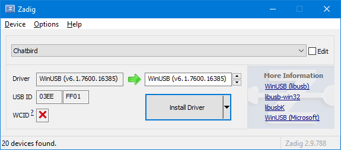
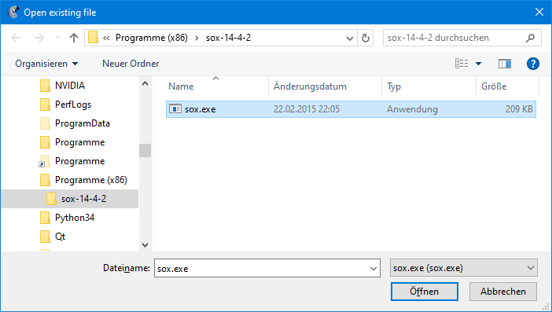
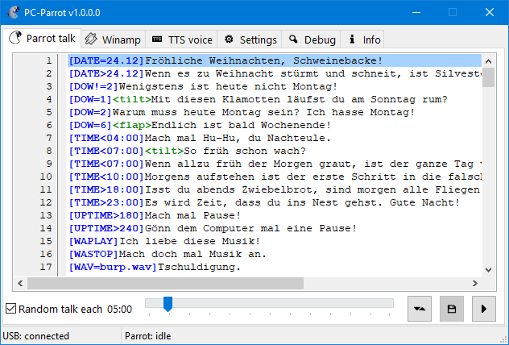
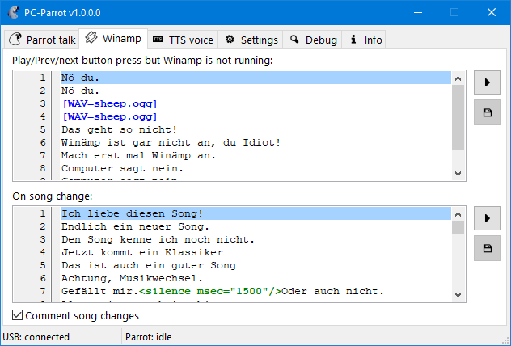
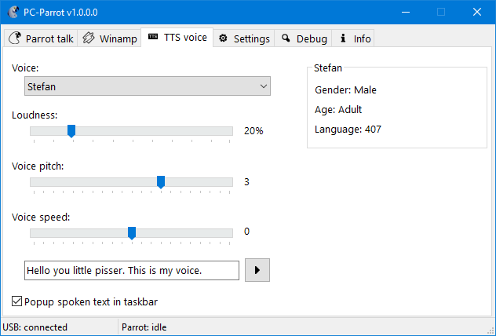
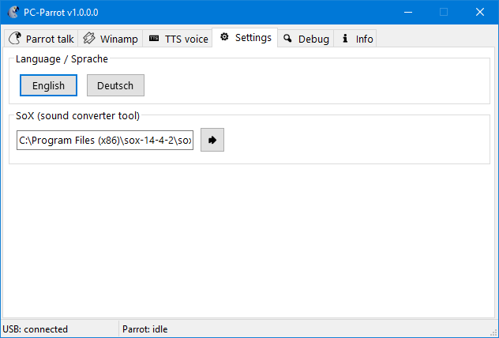
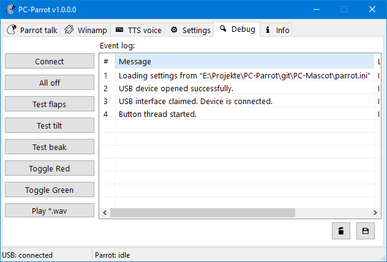

# PC-Parrot

A modern Windows software for the Mitsumi PC-Mascot.

This cute little fella is the **Mitsumi PCMASCOT** - a wing-flapping and babbling parrot robot USB gadget from the early 2000s that you would connect with your Windows PC.
It came with a software to have the parrot read your emails aloud or *"impress girls with 20 cool sayings"* (yep, that's what it said on the box.)

However the old software won't run anymore on modern Windows, so I analyzed the USB protocol and wrote a new software to make it work with any Windows again.
All you need is a Text-to-Speech engine (already integrated in Windows), a sound converter tool, a new USB driver and this software to make it working again.

I came across this oddity on eBay and got it running on an old WinXP machine. But I couldn't get the "read emails aloud" function to work; probably because no today's mail service would work with that outdated POP3 implementation.
Without the email feature, the buttons on the mascot are without function, which makes the PC-Mascot basically useless - apart, of course, from the girl-impressing sayings it chatters every now and then.
Thus, I decided to hack this thing and analyzed the protocol between the original software and the mascot using [usbpcap](https://github.com/desowin/usbpcap/). With the information gained this way and by peeking at [PetePrioritys chatbird](https://github.com/PetePriority/chatbird) Linux driver, I was able to write an own application which sends the commands to make the mascot move, talk and control its LEDs.

So, this is what the new software for the PC-Mascot can do:

- **runs on Win10** as well as **on WinXP** - and probably on **any other Windows** from this millennium

- lets you **control Winamp by pressing the buttons** on the parrot stand - perfect to control your music while gaming

- **controls all the parrot features** such like flap its wings, tilt its head, light its LEDs - just like the original software did

- lets the parrot chatter **countless customizable cheeky sayings** - even more girl-impressing than those lame original sayings

- lets the parrot **play any sound** file you wish - a cuckoo sound, a cat meowing or a Duke Nukem saying, whatever you want

---

# How to install

## USB driver

The original driver for the Mitsumi PC-Mascot won't work with modern Windows versions and the new software won't run with the original driver either.
Thus, download Zadig from [here](https://github.com/pbatard/libwdi/releases), run it and make it install a `WinUSB v6.1.x` USB driver for the *Chatbird or PCmascot* device (USB ID `03EE, FF01`):

Zadig will then install a generic libusb driver for the PC-Mascot.
The latest version of Zadig for WinXP was 2.2.

You won't need the original PC-Mascot software or the original Mitsumi driver at all. But if you have it installed, consider that <u>the original software won't be able to work after replacing the USB driver</u> with libusb.

## Text-to-speech

The parrot gadget does not speak by itself, but receives audio data via USB from the PC. The original software used IBMs ViaVoice for speech generation while the new software uses [Microsoft SAPI](https://en.wikipedia.org/wiki/Microsoft_Speech_API).
On newer Windows versions you probably won't have to install anything as it is integrated in the OS anyway. 
WinXP users might need to install the MS SAPI SDK. I recommend using SAPI 5.1, as I know it will work with that just fine. You can still download SAPI 5.1 from [Microsoft](https://www.microsoft.com/en-us/download/details.aspx?id=10121).

Additional TTS voices can be installed at anytime. You can also download some from the [archive.org](https://archive.org/).

## Sound converter tool

The microcontroller in the parrot gadget is able to receive and process mono-channel PCM audio with 16bit and 12kHz. Nothing else. So we need to transform any sound accordingly before sending it to the parrot.
The ideal tool for sound conversion is [SoX](https://sourceforge.net/projects/sox/) (Sound eXchange) - download and install it. 

I recommend version 14.4.2-win32 since this will still run on older WinXP systems as well.

## PC-Parrot

1. Download the PC-Parrot software from here and just unpack it to a location you want.

2. Open PCParrot.exe

3. The status in the left bottom corner should say "USB: Connected" when the Mitsumi PC-Mascot has been detected - otherwise check if the USB driver is installed correctly.

4. Go to the settings tab and specify where to find sox.exe (this needs to be done only once):
   
   

The first time PCParrot.exe is started, it will show up normally. Subsequent launches will show it minimized as an icon in the system tray of the Windows taskbar:

---

# Usage

## "Parrot talk" tab

You can let the parrot say randomly selected sayings from the list here at adjustable intervals.
Each line in the editor represents a saying. A saying can be subject to a condition - e.g. `[TIME>23:00]Good night` would only be said after 11:00 PM.
A saying can also include commands for the parrot - e.g. `<flap>` will make it flap its wings.
Check the included examples to see what other conditions and commands exist.

The software will randomly pick a line from the editor in adjustable intervals, make the parrot say it and execute the contained commands. You can increase the probability of a line by simply duplicating it.
Empty lines or lines starting with a `;` will cause the parrot to stay silent.

## "Winamp" tab

The *play*, *previous* and *next* buttons on the parrot stand can be used to control the playback of Winamp.
When pressing the buttons but Winamp is not running, the parrot will say a saying from the upper editor. On a song change of Winamp, the parrot will pick a line from the lower editor.

## "TTS voice" tab

Here you can select the parrots voice from the list of installed, SAPI compatible TTS voices and adjust it. The application will remember the settings when restarted.

Old TTS voices from the 2000s are sometimes hard to understand. To say the least. And playing them back on a coin-sized speaker in a weird parrot toy at 12kHz does not improve this. 
So I added a feature to popup a speech bubble, showing the spoken text in the taskbar tray:

You can enable/disable the speech bubbles in the options.

## "Settings" tab

You need to tell the software where to find the sound converter tool. Click on the button right beside the edit field and navigate to the location of `sox.exe` on your hard drive. Usually it will be something like `%ProgramFiles%\sox-14-4-2\sox.exe`.

You can also switch the GUI language here between English and German. This applies only to the user interface, not to the spoken language of the parrot. (To change the parrots language, install a TTS voice in the desired language and create sayings in that language.)

## "Debug" tab

The buttons and log events in this tab are for testing the functionality of the parrot robot and trouble-shooting.

---

That's it. I would be happy to know if anyone else out there still has such a Mitsumi mascot gadget and might find this software useful.
If so: feel free to download and distribute.
